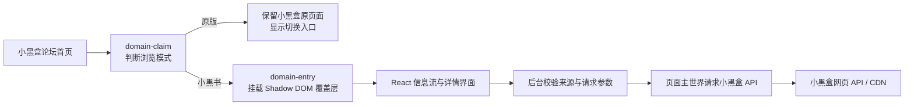

<div align="center">

# HeyNote 小黑书

**把小黑盒网页论坛重新整理成更适合连续浏览的“小红书式”信息流。**


</div>

HeyNote 的界面与交互设计灵感来自小红书网页版，并根据我个人使用习惯进行修改。当然，欢迎功能建议与 Bug 反馈。

稳定版本会由 GitHub Actions 自动构建并发布到 [Releases](../../releases)。

当前版本：`0.8.2`

> [!IMPORTANT]
> HeyNote 的重点是重新组织页面与阅读体验。

> [!CAUTION]
> 本项目依赖小黑盒当前的网页结构和未公开网页接口。小黑盒更新页面或接口后，部分功能可能暂时失效。HeyNote 与小黑盒、小红书均无隶属、合作或背书关系。

## 为什么做 HeyNote

小黑盒论坛有大量适合快速浏览的图片、视频和短内容，但原版网页更偏传统论坛列表。HeyNote 保留原站账号、内容和互动接口，只重新设计信息密度、瀑布流排版、帖子详情和图片查看方式，让网页端更适合发现内容与连续阅读。

## 主要功能

### 信息流

- 小红书式响应式瀑布流，按照卡片预计高度稳定追加到较短列。
- 提前批量预取后续信息流，滚动接近底部时继续加载并按帖子 ID 去重。
- 已显示的卡片在同一列数和筛选条件下不会因新一页到达而重新换列。
- 从小黑盒官方社区入口读取分区，切换分区后直接请求对应社区信息流。
- 支持图文、视频、文章三类内容筛选，并在本机保存筛选状态。
- 无图片帖子会根据标题生成文字封面，不留下空白卡片。
- 信息流直接显示并可操作点赞，数量格式与帖子详情保持一致。
- 标题和摘要支持小黑盒 `cube` / `heygirl` 表情标签。

### 搜索

- 搜索框获得焦点但未输入时，展示本地搜索历史和官方搜索发现。
- 输入文字后防抖请求官方联想接口，在搜索框下方展示联想结果，不提前切换结果页。
- 确认搜索后只提供“内容”和“用户”两类结果；内容结果只解析官方返回的帖子链接。
- 内容结果使用与首页一致的响应式瀑布流、图片懒加载、表情标签、点赞和帖子详情交互。
- 支持图文、视频、文章筛选，以及官方排序方式和时间范围筛选；筛选条件会同步到 URL，并重新请求官方接口。
- 用户结果展示头像、等级、勋章、关注状态和关注按钮，点击用户可在新标签页打开个人主页。
- 搜索结果按官方分页游标追加，不会因为单页可展示帖子较少而提前停止。

### 个人主页

- 支持查看自己的主页和其他用户主页，使用 HeyNote 自己的路由：`/app/bbs/home#/user/<用户 ID>`。
- 主页展示头像、昵称、等级、签名、IP 属地、勋章、关注/粉丝等资料，以及与首页一致的动态瀑布流。
- 自己的主页额外展示收藏和历史记录；查看他人主页时不展示这两项。
- 用户主页动态使用官方 `profile/events` 分页接口，按游标串行加载，避免重复请求和重复卡片。
- 帖子作者、评论区用户和搜索用户均可点击，并在新标签页打开对应的 HeyNote 用户主页。

### 帖子详情

- 普通图文采用左侧媒体、右侧作者/正文/评论的双栏弹层。
- 弹层会根据第一张图片的宽高比，在最小与最大宽度之间自适应。
- 图片轮播支持悬停箭头、页码、最多 20 个定位圆点以及鼠标拖拽翻页。
- 视频帖子使用独立播放器，支持进度、音量、倍速、画中画和全屏。
- 长文章使用独立阅读布局，保留富文本中图片与正文的原始相对位置。
- 作者等级、关注状态、内容标签、话题、日期和 IP 属地按接口返回内容展示。
- 支持帖子点赞、收藏、作者关注以及评论点赞；操作会请求小黑盒官方接口。

### 图片查看

- 信息流使用缩略图，帖子正文会在合适时机无闪烁地替换为原图。
- 普通图文只维持当前图片前后的小范围原图窗口，避免一次加载整组大图。
- 文章图片在接近可视区域时加载原图；评论图片仅在放大查看时请求原图。
- 全屏查看器支持适应页面、每次 ±25% 缩放、原始尺寸、旋转和拖动平移。
- 支持上一张/下一张、点击图片或空白区域退出，以及复制和下载原图。

### 评论

- 评论区与作者栏独立固定，右侧内容滚动时不显示原生滚动条。
- 支持评论图片、小黑盒表情、用户等级、点赞数、日期和 IP 属地。
- 支持继续加载评论分页以及“查看更多”楼中楼回复。
- 超长连续文本会在评论框内安全换行，不会撑破详情布局。
- 底部输入区域目前会打开原版帖子，评论与回复发布仍由小黑盒完成。

### 外观与原版切换

- 支持浅色、深色和跟随系统三种主题，设置保存在本机。
- 左下角可随时在“原版”和“小黑书”之间切换，选择会持久保存。
- 小黑书运行在 Shadow DOM 覆盖层内，不清空原站 DOM，也不污染原站样式。
- 只有 React 界面成功挂载后才隐藏原版内容；注入或渲染失败时自动恢复原版论坛。
- 首页、搜索、个人主页和帖子详情会根据当前内容设置清晰的页面标题，离开后恢复原页面标题。

## 支持范围

| 项目 | 当前支持情况 |
| --- | --- |
| 浏览器 | Chrome 102+；基于 Chromium 的新版 Edge 通常也可使用 |
| 页面 | `https://www.xiaoheihe.cn/app/bbs/home`，以及其 `/feed`、`/search`、`/user/<用户 ID>`、`/post/<帖子 ID>` 路由 |
| 系统 | 桌面端 Windows / macOS；Linux 尚未专项测试 |
| 登录 | 浏览公开内容可按小黑盒实际限制使用；点赞、收藏、关注等操作需要登录 |
| Firefox / Safari | 暂未适配 |

## ⬇️ 安装

### 本地安装

[Releases](../../releases)：稳定版

> [!WARNING]
> 请勿安装来源不明的二次打包版本。扩展可以在小黑盒登录页面环境中发起请求，请只使用本仓库 Releases 发布的 `extension.zip`。

#### Edge 和 Chrome（推荐）

> 请确保您从最新稳定版下载了 [extension.zip](../../releases/latest/download/extension.zip)，并先解压该文件。

1. 解压下载的 `extension.zip`，并保留解压后的完整文件夹。
2. 在 Edge 中打开 `edge://extensions/`，或在 Chrome 中打开 `chrome://extensions/`。
3. 开启“开发人员模式”或“开发者模式”。
4. 点击“加载解压缩的扩展”或“加载已解压的扩展程序”。
5. 选择刚才解压的扩展文件夹；该文件夹根目录应当直接包含 `manifest.json`。

#### 开始使用

先在浏览器中登录小黑盒，然后打开：

```text
https://www.xiaoheihe.cn/app/bbs/home
```

扩展默认进入小黑书界面。左下角的“浏览页面”设置可以切回原版；原版页面左下角也会保留相同格式的切换入口。

## 权限与隐私

浏览器安装扩展时会展示较宽泛的权限警告。HeyNote 当前申请的权限及用途如下：

| 权限 | 用途 |
| --- | --- |
| `storage` | 保存原版/小黑书模式、主题、内容筛选、本地收藏索引和版本状态 |
| `scripting` | 挂载小黑书界面，并在小黑盒页面主世界执行官方网页 API 请求 |
| `downloads` | 下载用户主动选择的帖子或评论图片 |
| `clipboardWrite` | 将用户主动选择的图片复制到剪贴板 |
| `www.xiaoheihe.cn` / `api.xiaoheihe.cn` | 读取论坛页面并请求小黑盒网页端接口 |
| `*.max-c.com` / `*.xiaoheihe.cn` | 加载和解析小黑盒使用的图片、视频及相关接口资源 |

为了复用小黑盒网页端登录状态，API 请求会在当前小黑盒标签页的页面环境中执行，并携带该站点自己的 Cookie；部分请求还会读取当前页面可访问的 `heybox_id` 作为官方接口参数。

- HeyNote 不申请 Chrome 的 `cookies` 权限。
- HeyNote 不保存账号、密码、Cookie 或访问令牌。
- HeyNote 不把登录信息发送到小黑盒以外的第三方服务。
- HeyNote 当前不包含额外的统计、广告或行为追踪代码。
- 主题、筛选、浏览模式等偏好只保存在浏览器本地扩展存储中。

## 工作原理



这种结构有两个目的：一是隔离原站与小黑书的 CSS；二是在界面异常时能够完整移除覆盖层，让原版小黑盒继续可用。

## 构建项目参考

环境要求、本地调试、生产构建、目录说明与正式发版流程，请查看 [构建与发布指南](docs/BUILD.md)。

## 已知限制

- 小黑盒网页接口没有面向本项目的稳定契约，字段变化可能导致解析失败。
- 当前主要接管论坛首页、搜索和用户主页；话题页等其他页面仍保留原版体验。
- 用户主页目前展示动态内容；收藏和历史记录只在自己的主页展示，尚未单独做成完整页面。
- 评论和回复发布仍需要前往原版帖子。
- 极复杂的历史文章 HTML 可能无法完全复刻原版排版。
- 图片原图、视频和已删除内容是否可访问，仍取决于小黑盒账号权限和 CDN 状态。
- 当前没有 Firefox、Safari、移动浏览器和无障碍工具的完整兼容测试。

## 问题反馈

欢迎通过 [Issues](../../issues) 提交功能建议与 Bug 反馈。反馈页面或接口问题时，建议附上：

- 浏览器与扩展版本。
- 可复现的帖子链接。
- 必要的界面截图。
- 已隐去个人信息的控制台错误。

> [!WARNING]
> 请勿在 Issue、截图或日志中提交 Cookie、令牌、完整请求头、手机号或其他账号隐私信息。

## 免责声明

HeyNote 是非官方、源码公开的浏览器扩展，仅用于改善网页浏览体验，与小黑盒、小红书及其关联公司不存在隶属、合作、授权或背书关系。“小红书式”只描述界面和交互方向，不代表复制其服务或品牌。

帖子、评论、图片、视频、头像、表情、商标及其他内容的权利归原作者或相应权利人所有。使用者应遵守小黑盒服务条款、当地法律法规及内容权利人的要求，并自行承担使用本扩展产生的风险。

## 许可证

本项目采用 [Custom License](LICENSE)。项目源码仅允许用于查看、学习、研究和非商业性修改；未经书面许可，不得以浏览器插件、浏览器扩展、独立客户端、桌面应用或移动应用等形式公开发布、分发修改版或衍生产品。许可证中的“客户端”明确包括浏览器插件和浏览器扩展。除许可证明确授权外，保留所有其他权利。
